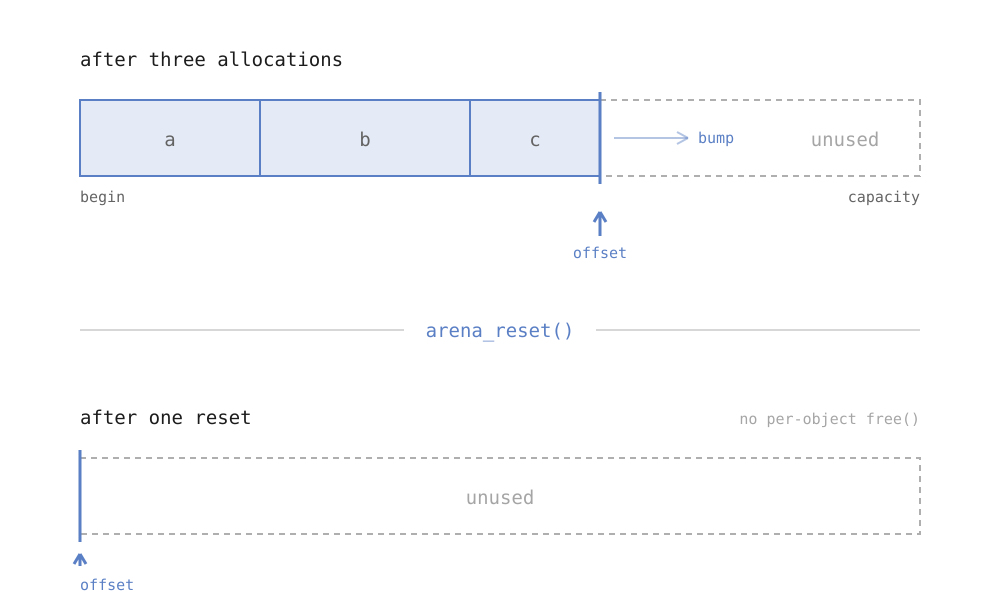

Most of the memory I allocate has an obvious moment where it stops being
useful. A request finishes. A frame ends. A file is done parsing. Everything
that was scratch work for that unit of time dies with it.

`malloc` and `free` don't know that. They make me track it, object by object,
even though the objects all share one lifetime.

## One buffer, one cursor

An arena takes the lifetime seriously. Reserve a block up front, keep an offset
into it, and hand out slices by moving the offset forward. Freeing isn't a
per-object operation at all — you set the offset back to zero.



Allocation moves one cursor. Reset moves it back.

The whole allocator is this:

```c
typedef struct {
    unsigned char *base;
    size_t         capacity;
    size_t         offset;
} Arena;

void *arena_alloc(Arena *a, size_t size, size_t align) {
    size_t cur     = (size_t)(uintptr_t)(a->base + a->offset);
    size_t padding = (align - (cur & (align - 1))) & (align - 1);

    if (a->offset + padding + size > a->capacity) return NULL;

    void *p    = a->base + a->offset + padding;
    a->offset += padding + size;
    return p;
}

void arena_reset(Arena *a) { a->offset = 0; }
```

That's the load-bearing part. The other hundred-odd lines are a growable list
of blocks, a `arena_alloc_zeroed`, and a debug mode that poisons the buffer on
reset so use-after-reset shows up as an obvious pattern instead of as data that
happens to still be there.

## What you give up

This is not a general-purpose allocator and it will hurt you if you treat it
like one:

- You cannot free one object. If some allocations outlive the arena's cycle,
  they don't belong in it.
- A pointer into the arena is dangling the instant you reset, and nothing will
  tell you. This is the bug you'll actually hit.
- Fragmentation becomes your problem. A long-lived arena that never resets is
  just a leak with better branding.
- Sizing is a guess. Too small and you fall back or fail; too large and you're
  holding memory you never touch.

## What you get

`arena_reset` is a single store. No traversal, no free list, no per-object
bookkeeping, and no chance of freeing something twice — the operation doesn't
exist.

The part I didn't expect was what it did to the code around it. Once a whole
subsystem allocates from one arena, functions stop returning ownership and
start returning pointers. The `goto cleanup` ladders disappear. Error paths get
shorter, because the error path and the success path free exactly the same
thing: nothing.

Allocation stopped being a thing I thought about per call, and became a thing I
decided once, per lifetime.
