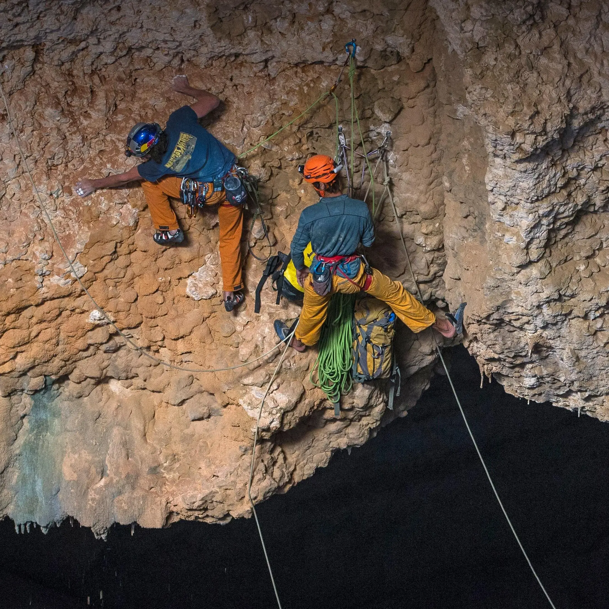

Before a climber leaves the ground, someone else checks their harness, their
knot, and the belay device. Out loud, every time, including when both people
have done it ten thousand times.

The check takes about ninety seconds and never gets skipped.

## Why the ritual survives

It's four questions, it's always the same four, and it's not about competence:

- Is the harness buckled and doubled back?
- Is the knot tied, dressed, and finished?
- Is the rope through the belay device the right way, and is the carabiner
  locked?
- Are both ends accounted for — knot in the tail, enough rope for the descent?

Nobody's judgment is being questioned. The check runs in the same order whether
you're on your third day or your twentieth year. That's what makes it
survivable socially, which is what makes it actually happen.

## The property that transfers

Code review works when it has the same shape and stops working when it doesn't.

A checklist applied uniformly is a ritual, and rituals are cheap to comply with
because they say nothing about you. A reviewer who reads closely only the code
from people they don't trust yet is doing something else — and everybody can
tell, including the person being read closely.

The other half is that a belay check is specific enough to fail. "Looks good"
is not a belay check. Neither is an approving review with no comments on a
four-hundred-line diff; it's a social gesture wearing a checkmark.

Worth knowing which one you're doing.
