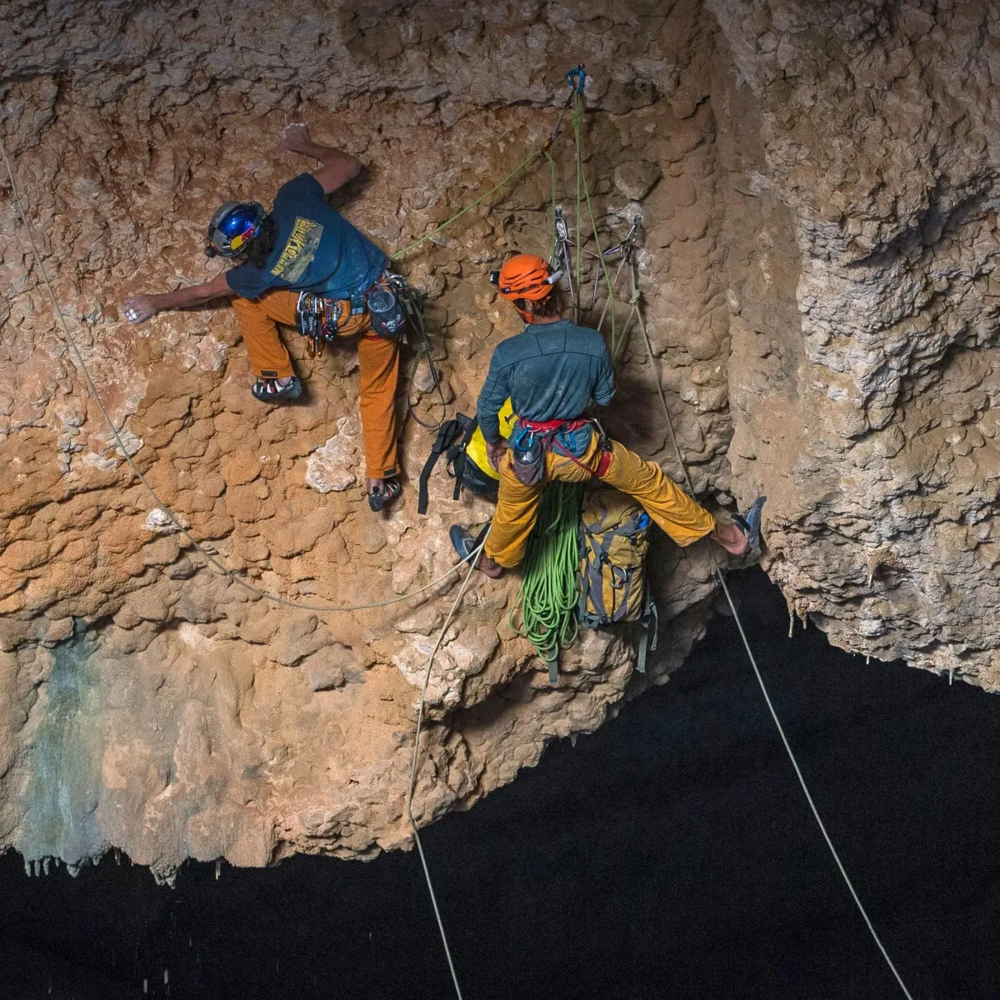

A climbing harness does nothing on a good day. You clip in, you climb, you top
out, you lower off, and the harness was irrelevant the whole time. It only
earns its cost during the half-second nobody planned for.

Overhanging limestone, somewhere past the third bolt.

Test harnesses are the same shape. The code that builds a fixture, captures
output, and tears the world back down is invisible when everything passes.
Nobody demos it. Nobody puts it in the changelog.

## Which is why people under-build them

The failure mode is predictable. The harness gets written once, in a hurry, by
whoever needed the first test to run. It works for that test. Then it accretes
flags for the next twelve, and by the time it's load-bearing nobody wants to
touch it.

So it's worth budgeting for the bad day up front. When a test fails at 2am, the
harness should already be able to tell me:

- which input produced the failure, in a form I can replay by hand
- what the process actually saw — env, working directory, clock, seed
- whether this is the first failure or the fourth in a row
- how to run this one case alone, without the other four hundred

None of that helps a passing suite. That's the point.

## The real question

The question to ask of a harness isn't "does the suite pass." It's "when
something breaks and I wasn't watching, does this tell me what broke." A green
checkmark is the least interesting thing it produces.
